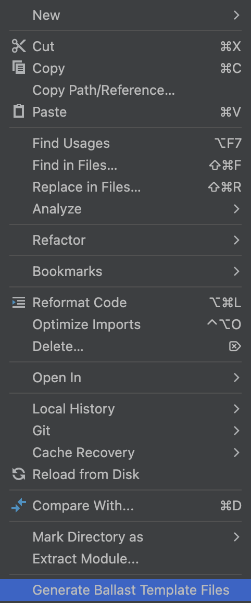

# Ballast Companion Template Generator

## Description
<!-- Plugin description -->
This plugin is designed to use in conjunction with the [Ballast MVI Kotlin Multiplatform library](https://github.com/copper-leaf/ballast) by [copper-leaf](https://github.com/copper-leaf).
<!-- Plugin description end -->

### Available through the Jetbrains Marketplace (IDE > Plugins > Marketplace) or downloadable [here](https://plugins.jetbrains.com/plugin/25295-ballast-template-files-generator)!



## Template generation

The plugin will generate the 4 core files necessary for the [Ballast mental-model](https://copper-leaf.github.io/ballast/wiki/usage/mental-model/), including a file containing the
Composable screen.

Given the `Example` prefix/feature, the following will be generated:

### Screen
```kotlin
@Composable
fun ExampleScreen(
    state: ExampleScreenContract.State,
    postInput: (ExampleScreenContract.Inputs) -> Unit
) {

}
```

### Contract
```kotlin
object ExampleContract {

    @Immutable
    data class State()

    sealed interface Inputs {}

    sealed interface Events {}
}
```
### InputHandler
```kotlin
typealias ExampleContractInputHandler = InputHandler<ExampleContract.Inputs, ExampleContract.Events, ExampleContract.State>
typealias ExampleContractInputHandlerScope = InputHandlerScope<ExampleContract.Inputs, ExampleContract.Events, ExampleContract.State>

class ExampleInputHandler : ExampleContractInputHandler {
    override suspend fun ExampleContractInputHandlerScope.handleInput(input: ExampleContract.Inputs) = try {
        when (input) {

        }
        Unit
    } catch (e: Exception) {
        e.printStackTrace()
    }
}
```

### EventHandler
```kotlin
typealias ExampleContractEventHandler = EventHandler<ExampleContract.Inputs, ExampleContract.Events, ExampleContract.State>
typealias ExampleContractEventHandlerScope = EventHandlerScope<ExampleContract.Inputs, ExampleContract.Events, ExampleContract.State>

class ExampleEventHandler : ExampleContractEventHandler {
    override suspend fun ExampleContractEventHandlerScope.handleEvent(event: ExampleContract.Events) = try {
        when (event) {
    
        }
        Unit
    } catch(e: Exception) {
        e.printStackTrace()
    }
}
```

### ViewModel
```kotlin
class ExampleViewModel(
    viewModelCoroutineScope: CoroutineScope,
) : BasicViewModel<
        ExampleContract.Inputs,
        ExampleContract.Events,
        ExampleContract.State
        >(
    config = BallastViewModelConfiguration.Builder()
        .withViewModel(
            initialState = ExampleContract.State(),
            inputHandler = ExampleInputHandler(),
        )
        .dispatchers(
            inputsDispatcher = Dispatchers.Main.immediate,
            eventsDispatcher = Dispatchers.Main.immediate,
            sideJobsDispatcher = Dispatchers.Default,
            interceptorDispatcher = Dispatchers.Default
        )
        .build(),
    eventHandler = ExampleEventHandler(),
    coroutineScope = viewModelCoroutineScope,
)
```
